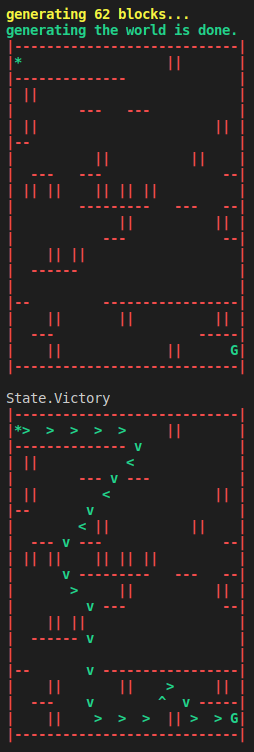

# An Educational Project
This project is made for educational purposes.\
I solved two diffrent problems and created one game in one repository and made a README.md file for each one of them.\
Hope everyone like it.

## Maze Problem
Maze problem is solved with A* algorithm.\
For more details about implementation, read [README](maze_problem/README.md) in the "**maze_problem**" folder.\
Output test of the project is something like this:\

## 8 Queens Problem
I solved this problem with simulated annealing algorithm (Comming Soon).

## Tic-Tac-Toe Game
Designed the game with Alpha-Beta Pruning Algorithm (Comming Soon).
