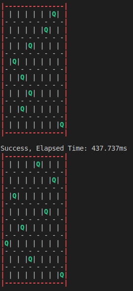
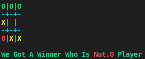

# An Educational Project
This project is made for educational purposes.\
I solved two diffrent problems and created one game in one repository and made a README.md file for each one of them.\
Hope everyone like it.

## Maze Problem
Maze problem is solved with __A*__ algorithm.\
For more details about implementation, read [README](maze_problem/README.md) in the ["**maze_problem**"](maze_problem) folder.\
Output test of the project is something like this:\

## 8 Queens Problem
8 queens problem is solved with __Simulated Anealing__ algorithm.\
For more details about implementation, read [README](queens_problem/README.md) in the ["**queens_problem**"](queens_problem) folder.\
Output test of the project is something like this:\

## Tic-Tac-Toe Game
Tic-Tac-Toe's artificial intelligence is created with __Alpha Beta Purning__ algorithm.\
For more details about implementation, read [README](tic_tac_toe/README.md) in the ["**tic_tac_toe**"](tic_tac_toe) folder.\
Output test of the project is something like this:\

